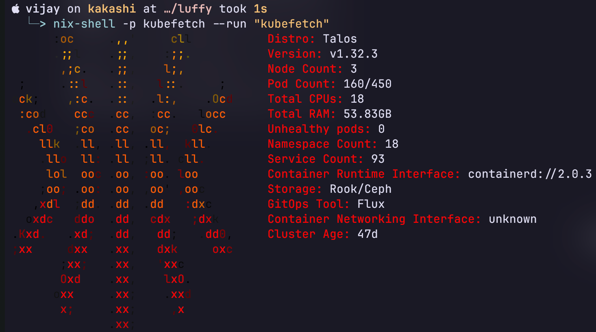

# GitOps Workflow for Kubernetes Cluster



Leverages [flux](https://github.com/fluxcd/flux2) to automate cluster state using code residing in this repo

## :computer:&nbsp; Infrastructure

See the [talos cluster setup](../kubernetes/luffy/talos/) for more detail about hardware and infrastructure

## :gear:&nbsp; Setup

(run from the repo root)

Use talhelper to generate the config files in the `clusterconfig` directory.

```shell
task talos:generate-clusterconfig
```

Bootstrap the talos nodes. It may take some time for the cluster to be ready.

```shell
task k8s-bootstrap:talos
```

## kubernetes setup & bootstrapping

Bootstrap the kubernetes cluster with required prerequisites (cilium CNI, CRDs, flux, etc).

```shell
task k8s-bootstrap:apps
```

## :wrench:&nbsp; Workloads (by namespace in kubernetes/)

* [cert-manager](../kubernetes/luffy/apps/cert-manager/)
* [database](../kubernetes/luffy/apps/database/)
* [downloads](../kubernetes/luffy/apps/downloads/)
* [flux-system](../kubernetes/luffy/apps/flux-system/)
* [media](../kubernetes/luffy/apps/media/)
* [monitoring](../kubernetes/luffy/apps/monitoring/)
* [network](../kubernetes/luffy/apps/network/)
* [security](../kubernetes/luffy/apps/security/)
* [selfhosted](../kubernetes/luffy/apps/selfhosted/)
* [storage](../kubernetes/luffy/apps/storage/)
* [system](../kubernetes/luffy/apps/system/)
* [system-upgrade](../kubernetes/luffy/apps/system-upgrade/)
* [system-controllers](../kubernetes/luffy/apps/system-controllers/)
 
## :robot:&nbsp; Automation

* [Renovate](https://github.com/renovatebot/renovate) keeps workloads up-to-date by scanning the repo and opening pull requests when it detects a new container image update or a new helm chart
* [System Upgrade Controller](https://github.com/rancher/system-upgrade-controller) automatically upgrades talos and kubernetes to new versions as they are released
